# Tour Guide Architecture Diagrams

This document contains C4 model diagrams and UML diagrams for the Tour Guide system.

## C4 Model Diagrams

### Level 1: System Context Diagram

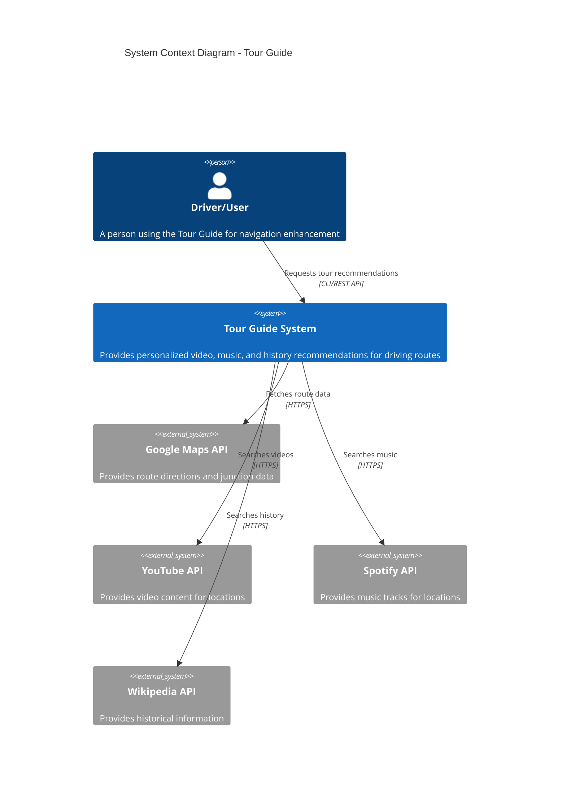

### Level 2: Container Diagram

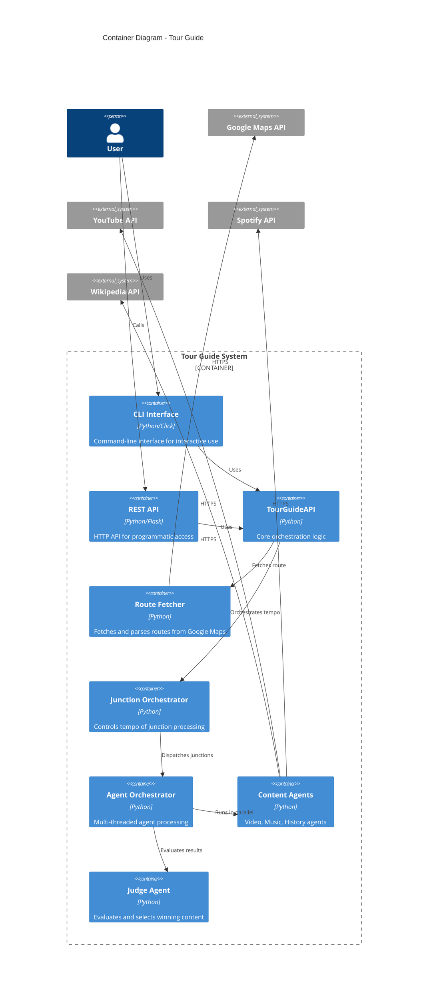

### Level 3: Component Diagram - Agent Orchestrator

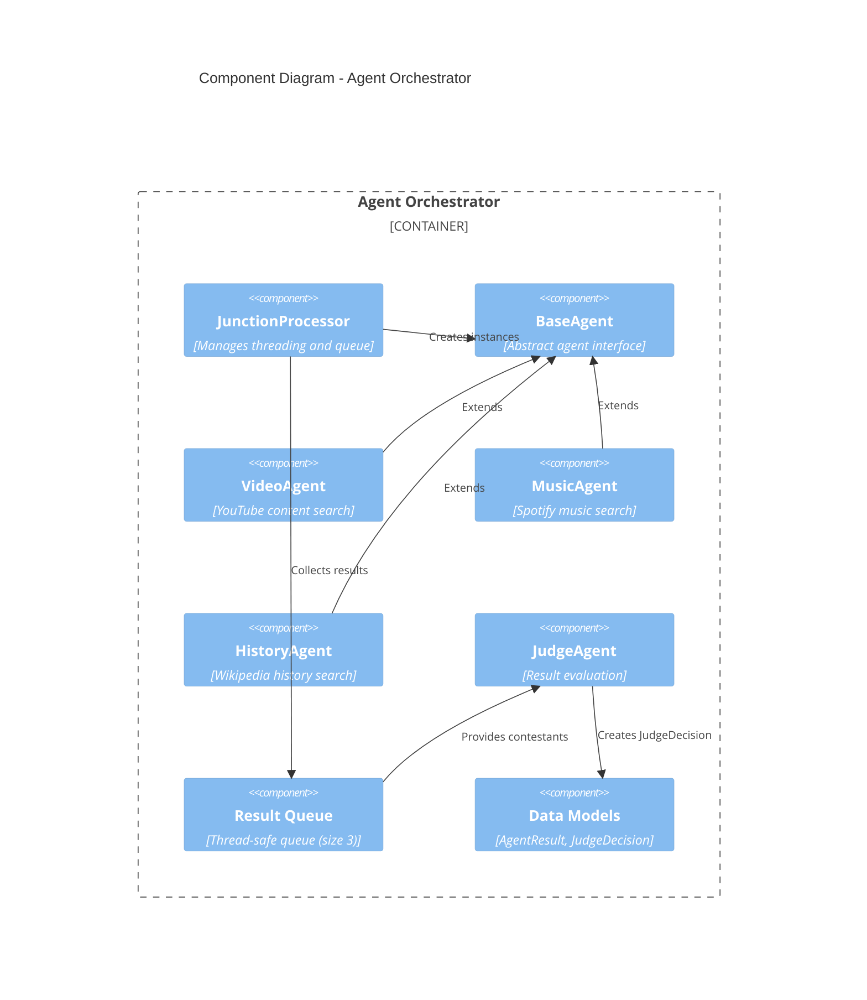

## UML Diagrams

### Class Diagram - Core Domain Model

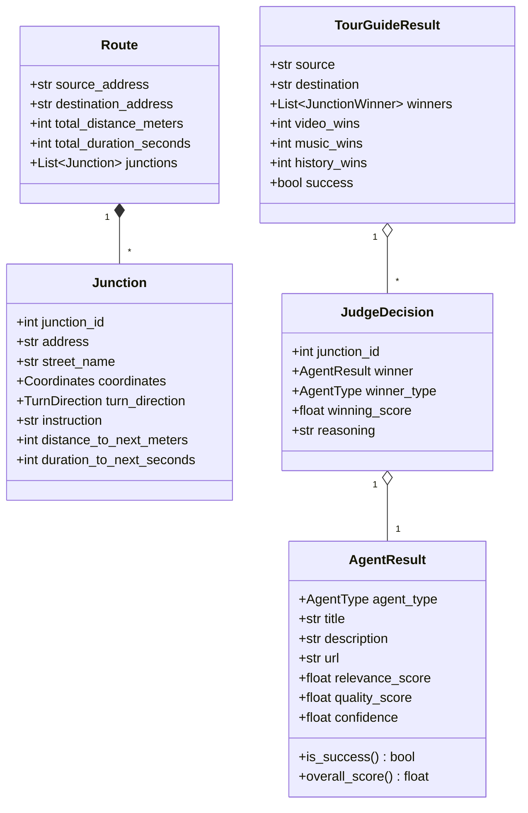

### Class Diagram - Agent Hierarchy

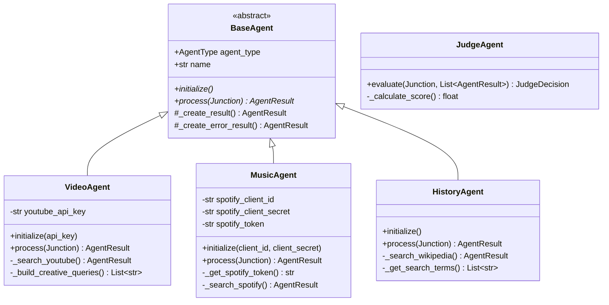

### Sequence Diagram - Tour Processing Flow

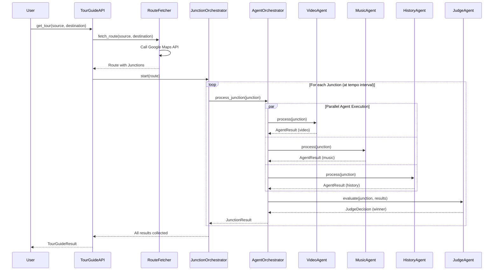

### Sequence Diagram - Agent Processing Detail

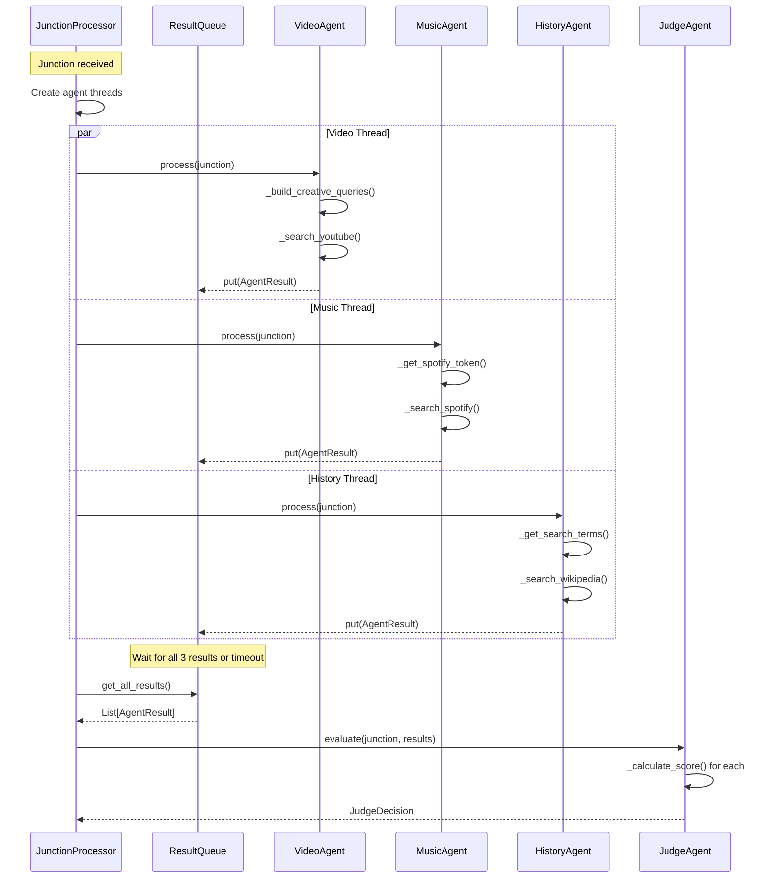

### Activity Diagram - Junction Processing

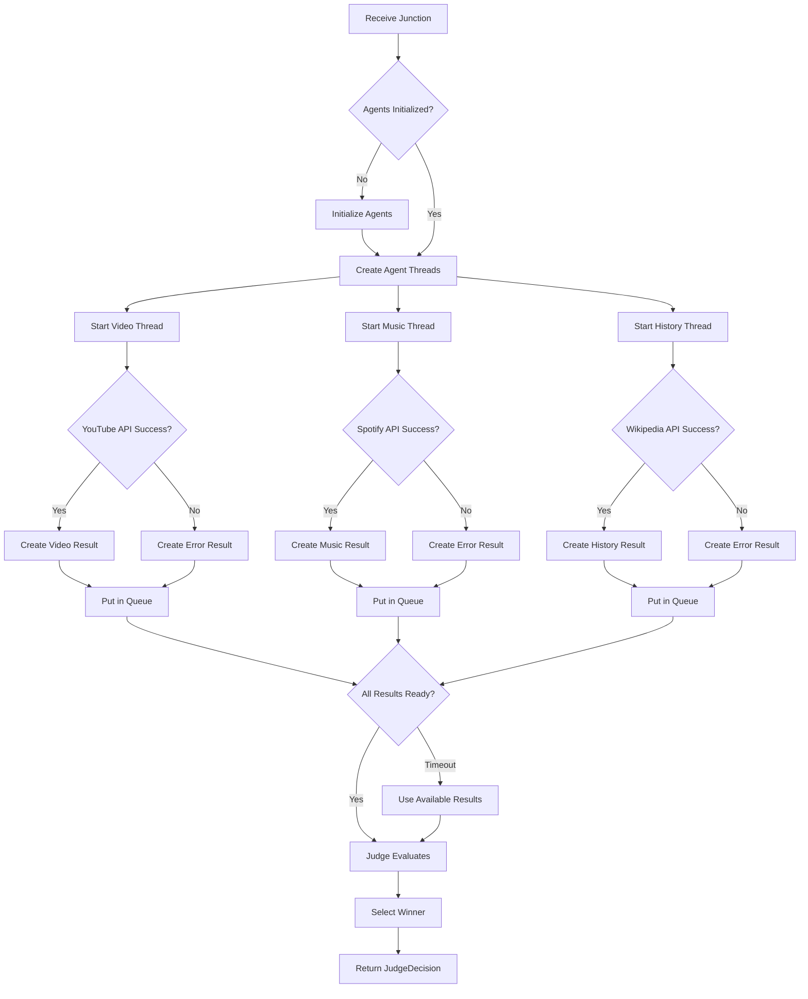

### State Diagram - Orchestrator States

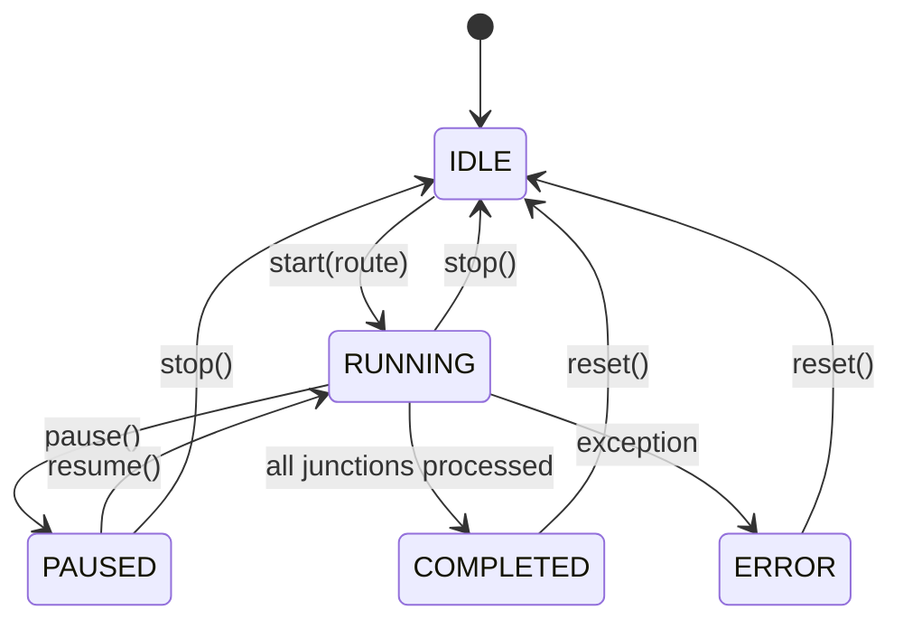

## Deployment Diagram

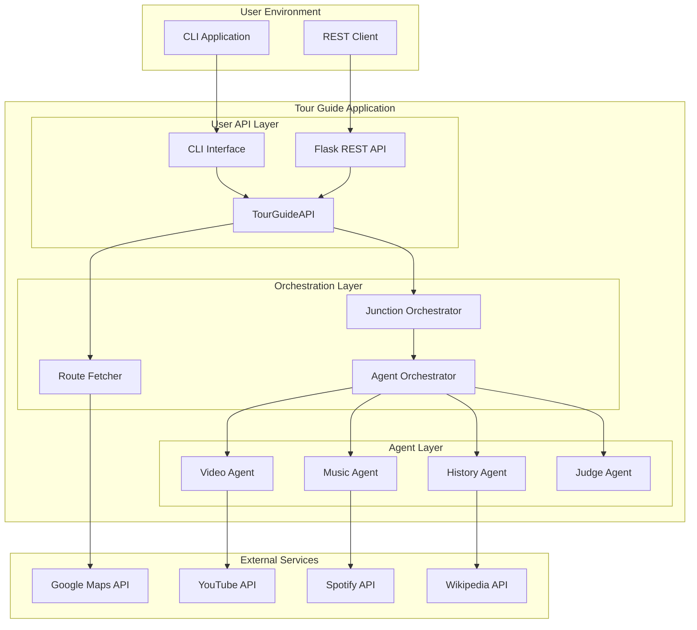

## Data Flow Diagram

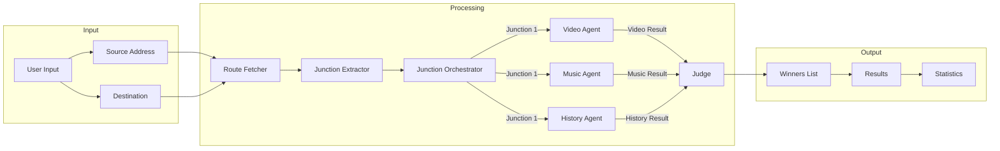

## Notes

### Diagram Rendering

These diagrams use [Mermaid](https://mermaid.js.org/) notation and can be rendered:

1. **GitHub**: Renders automatically in markdown files
2. **VS Code**: Use "Markdown Preview Mermaid Support" extension
3. **Online**: Use [Mermaid Live Editor](https://mermaid.live/)
4. **Documentation**: Use mkdocs with mermaid plugin

### C4 Model Levels

| Level | Name | Purpose |
|-------|------|---------|
| 1 | Context | System boundaries and external actors |
| 2 | Container | High-level technology decisions |
| 3 | Component | Internal structure of containers |
| 4 | Code | Class-level detail (see class diagrams) |

### Related Documentation

- [ARCHITECTURE.md](ARCHITECTURE.md) - Detailed architecture description
- [API_REFERENCE.md](API_REFERENCE.md) - API documentation
- [DEVELOPER_GUIDE.md](DEVELOPER_GUIDE.md) - Development guide
